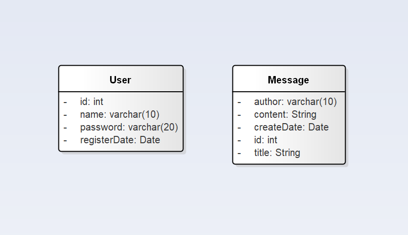

### 小组成员

17373340 刘群洋 发布留言部分的前后端设计

17373351 王卓立 用户管理部分的前后端设计

17373353 范嘉诚 用户管理部分的前后端设计

17373360 雷宇轩 发布留言部分的前后端设计

### 项目目的

编写一个可以供大家随意发布言论的网络留言板

### 运行环境

JDK版本12.0.1，可以运行在任何支持Java的硬件和操作系统上

### 类设计

### 项目架构

* 后端使用 Spring Boot 作为框架，使用 Gradle 进行项目构建
* 前端使用 Vue.js 作为框架，代码位于/messageboard-vue下

### 第三方库

* 使用 mysql-connector-java 进行数据库的连接
* 使用 MyBatis 进行数据持久化
* 使用 PageHelper 进行数据查询的分页处理

### 使用到的算法

* md5